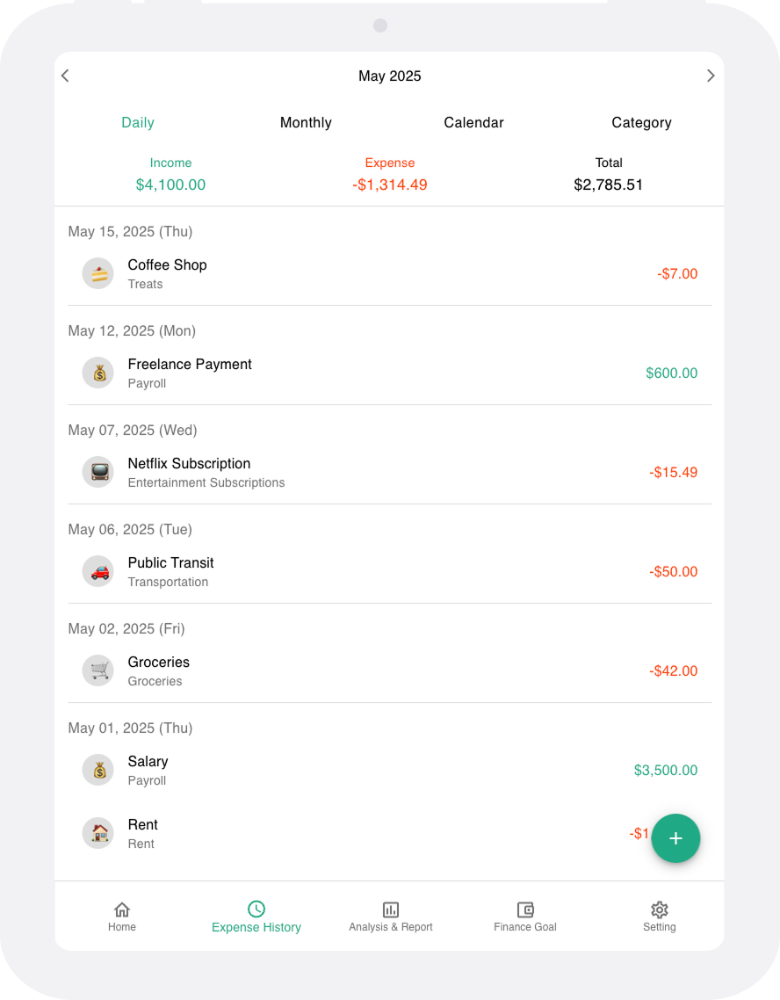

# Hi, I’m Hyeonah 👋

## 👩🏻‍💻 About Me

### 🔌 <strong>Hardware & Software Integration Engineer @ ChargeLab</strong> 

I ensure EV chargers work seamlessly with ChargeLab’s platform through QA testing, performance tuning, and issue resolution. I’ve developed automation tools that reduced testing time from weeks to days, accelerating charger verification and deployment across North America.

### 💻 <strong>Full-Stack Developer</strong> 

I build secure and scalable web apps using: 
• Frontend: React.js, Next.js, TypeScript ⚛️ 
• Backend: Node.js, Express.js 🔙 
My experience spans from frontend development to system-level automation, enabling me to solve problems with both speed and precision.

### 🤝 <strong>Soft Skills That Drive Results</strong> 

• Effective cross-functional collaboration 🧩 
• Analytical thinking and clear documentation 📝 
• Adaptive and growth mindset 🌱 
• Problem-solving with a proactive mindset 💡

### 🚀 <strong>Driving Innovation</strong> 

I’m driven by curiosity and a desire to build software that solves real business problems. Whether optimizing EV charger performance or developing web apps, I turn complex needs into impactful, user-focused solutions that support innovation and business growth.

## 🔥 Recent Projects

<table>
  <tr>
    <td style="width: 50%; height: 340px; vertical-align: top; text-align: center;">
        <strong>Finance Tracker (React.js, Express.js)</strong> 
        
Finance Tracker is a full-stack app that helps users manage income and expenses, view trends, and visualize data using charts and filters

        
    </td>
    <td style="width: 50%; height: 340px; vertical-align: top; text-align: center;">
        <strong>Go Together Service (Next.js)</strong> 
        
Go Together is a travel service platform that provides convenient vacation package bookings

        
    </td>
  </tr>
  <tr>
    <td style="width: 50%; height: 320px; vertical-align: top; text-align: center;">
      <strong>Go Together Admin (Next.js)</strong> 
      Go Together Admin is designed for adding vacation packages to the GoTogether service site  
      
    </td>
    <td style="width: 50%; height: 320px; vertical-align: top; text-align: center;">
      <strong>Portfolio (Next.js)</strong> 
      Visit my portfolio website to explore my recent projects, skills, and journey!  
      
    </td>
  </tr>
  <tr>
    <td style="width: 50%; height: 320px; vertical-align: top; text-align: center;">
      <strong>Fresh Tomatoes (Vanilla JavaScript)</strong> 
      Fresh Tomatoes is a user-friendly platform with an OMDb API database for seamless movie and TV show discovery  
      
    </td>
    <td style="width: 50%; height: 320px; vertical-align: top; text-align: center;">
      <strong>Tumbler Shop (Vue.js)</strong> 
      Tumbler Shop is an online shopping mall website where you can conveniently order tumblers  
      
    </td>
  </tr>
</table>

<!-- ## 💎 Skills

### Front-end

### Back-end

 -->

<!-- ### Design

 -->

<!-- ### Collaboration & Tools

 -->
