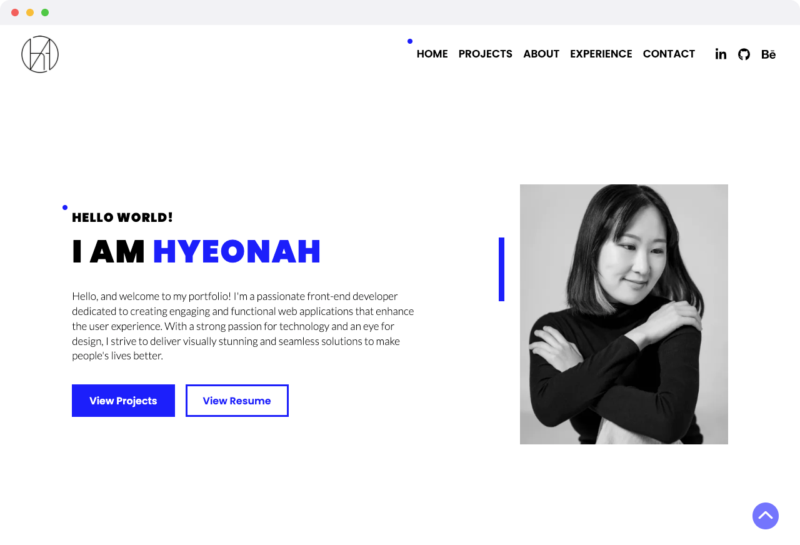
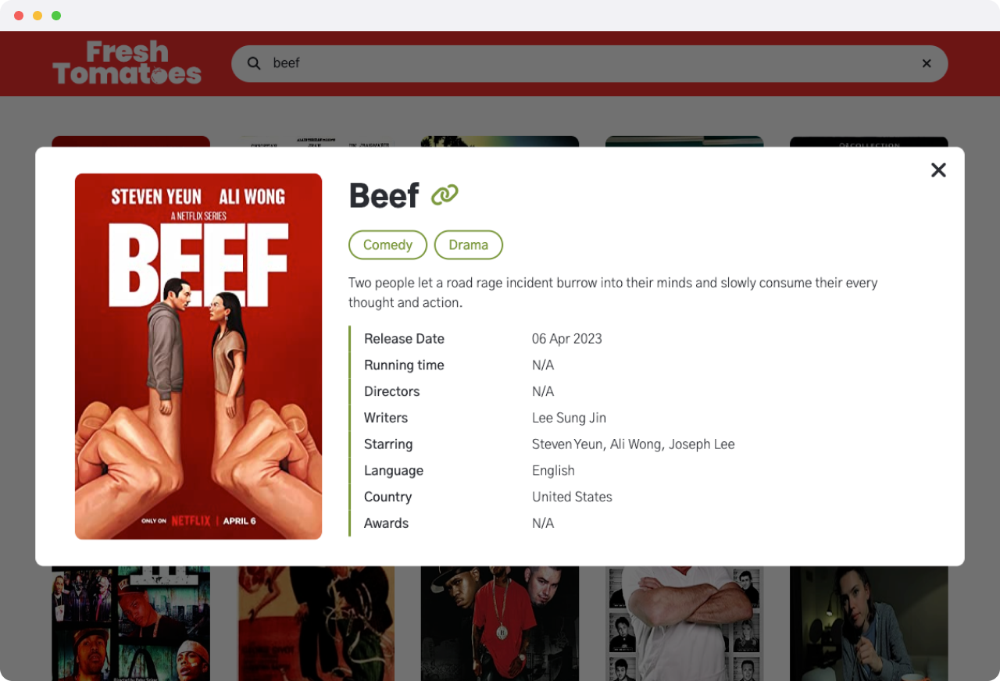
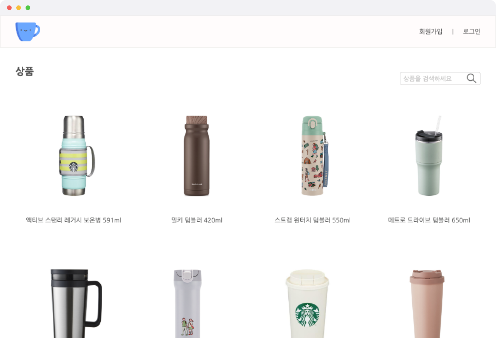
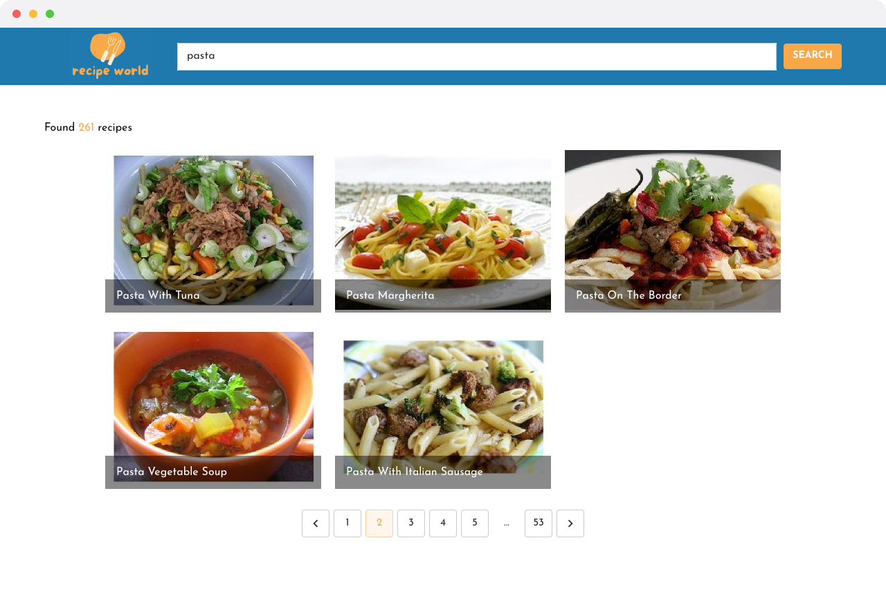
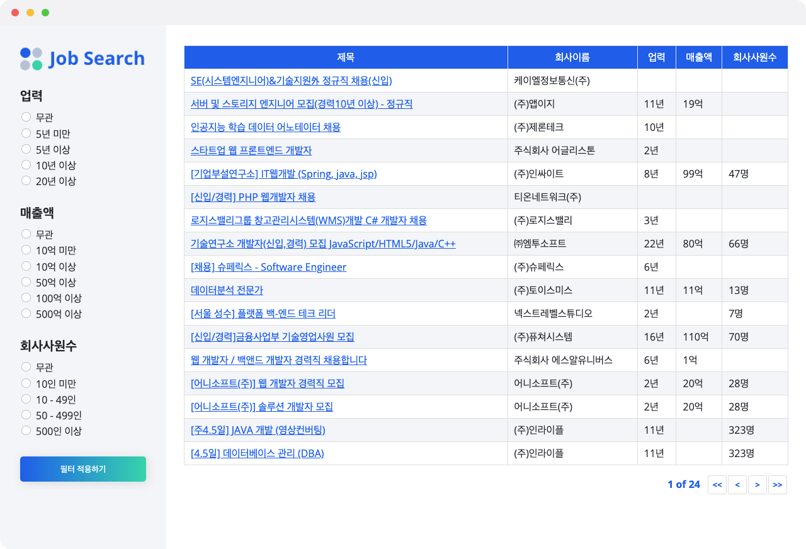

# Hi, I’m Hyeonah 👋

## 👩🏻‍💻 About Me

Hi there! I'm Hyeonah, currently a Hardware Integration Engineer at ChargeLab. In my role, I ensure that electric vehicle chargers seamlessly integrate with the software. Now, I'm thrilled to dive into the world of software development and take on full-stack projects.  This GitHub highlights my journey as I transition into software development. Here, you'll find a mix of personal projects and collaborative efforts that demonstrate my growth and skills in this new field.   Visit <a href="https://hyeonah-portfolio.vercel.app/">my portfolio website</a> to explore my journey : )

## 🔥 Recent Projects

|                                                                                                      Go Together Service (Next.js)                                                                                                       |                                                                                                           Go Together Admin (Next.js)                                                                                                            |
| :--------------------------------------------------------------------------------------------------------------------------------------------------------------------------------------------------------------------------------------: | :----------------------------------------------------------------------------------------------------------------------------------------------------------------------------------------------------------------------------------------------: |
| Go Together is a travel service platform that provides convenient vacation package bookings  

 | Go Together Admin is designed for adding vacation packages to the GoTogether service site  

 |

|                                                                                                 Portfolio (Next.js)                                                                                                  |                                                                                                           Fresh Tomatoes (Vanilla JavaScript)                                                                                                            |
| :------------------------------------------------------------------------------------------------------------------------------------------------------------------------------------------------------------------: | :------------------------------------------------------------------------------------------------------------------------------------------------------------------------------------------------------------------------------------------------------: |
| Visit my portfolio website to explore my recent projects, skills, and journey!  

 | Fresh Tomatoes is a user-friendly platform with an OMDb API database for seamless movie and TV show discovery  

 |

|                                                                                                      Tumbler Shop (Vue.js)                                                                                                      |                                                                                                          Recipe World (React.js)                                                                                                          |
| :-----------------------------------------------------------------------------------------------------------------------------------------------------------------------------------------------------------------------------: | :---------------------------------------------------------------------------------------------------------------------------------------------------------------------------------------------------------------------------------------: |
| Tumbler Shop is an online shopping mall website where you can conveniently order tumblers  

 | Recipe World is a recipe search website that utilizes a database obtained from the spoonacular API  

 |

|                                                                                                         Fast Bank (React.js)                                                                                                         |                                                                                                                 Job Search Board (React.js)                                                                                                                  |
| :----------------------------------------------------------------------------------------------------------------------------------------------------------------------------------------------------------------------------------: | :----------------------------------------------------------------------------------------------------------------------------------------------------------------------------------------------------------------------------------------------------------: |
| FastBank is a service app that recommends banking products tailored to the user's age and occupation  

 | Job Search is a compact API that allows you to filter three options directly from the results page of a Job Board  

 |

## 💎 Skills

### Front-end

### Back-end

<!-- ### Design

 -->

<!-- ### Collaboration & Tools

 -->
